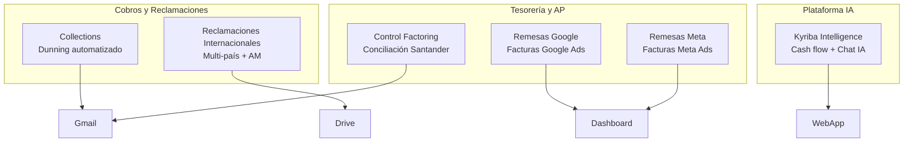

<div align="center">

# 👋 Hola, soy Miguel Hernández

### Desarrollador de automatización financiera · Google Apps Script · TypeScript · IA aplicada a tesorería

[](https://developers.google.com/apps-script)
[](https://www.typescriptlang.org/)
[](https://nextjs.org/)
[](https://sheets.google.com)

*Transformo procesos manuales de tesorería, cobros y factoring en sistemas automatizados, trazables y listos para producción.*

</div>

---

## 🎯 Sobre mí

Soy desarrollador especializado en **automatización financiera** dentro del ecosistema **Google Workspace**. Mi trabajo se centra en departamentos de tesorería y cobros de grupos empresariales internacionales: elimino trabajo repetitivo, reduzco errores humanos y construyo herramientas que los equipos financieros usan cada día.

Mi enfoque combina **reglas de negocio rigurosas**, **trazabilidad completa** y, en mi proyecto más ambicioso, **inteligencia artificial con cálculo determinista** — el LLM nunca inventa cifras.

---

## 🛠️ Stack tecnológico

| Área | Tecnologías |
|------|-------------|
| **Automatización** | Google Apps Script, Gmail API, Drive API v3, Google Sheets |
| **Full-stack** | Next.js 15, React 19, Fastify, Turborepo, TypeScript |
| **Datos** | Drizzle ORM, SQLite, parsers CSV/XLSX, pipelines ETL |
| **IA** | Vercel AI SDK, Gemini 2.5 Pro, Claude Sonnet, arquitectura multi-agente |
| **Calidad** | Vitest, golden tests, validación contra Looker Studio |

---

## 🚀 Proyectos destacados

### 🏦 Kyriba Intelligence — Plataforma de tesorería con IA

> *Proyecto full-stack · Monorepo TypeScript · Portfolio personal*

Plataforma que centraliza datos de cash flow exportados desde **Kyriba/Excel**, los versiona en base de datos y ofrece dashboard web + chat analista con IA.

**Lo que hace especial a este proyecto:**
- Importación ACID de **6.000+ transacciones**, calendario de caja, pólizas y tipos de cambio
- KPIs alineados con **Looker Studio** (Customer Collections, Google, Net Intercompany)
- Chat con **SQL determinista**: el LLM enruta herramientas, **nunca calcula cifras**
- Orchestrator multi-agente: `AnalystSQL → Validator → Narrator`
- **8/8 golden tests** pasando · 11/11 checks de validación de importación

```
Excel / Google Sheets → Pipeline ingest → SQLite versionado
                              ↓
              ┌───────────────┴───────────────┐
              ↓                               ↓
      Dashboard Next.js 15              Orchestrator IA
      /cashflow · /polizas · /chat      Gemini + Claude
```

**Stack:** `Next.js 15` · `Fastify` · `Drizzle ORM` · `Turborepo` · `Gemini` · `Claude`

---

### 📧 Motor de Tesorería y Reclamaciones (Collections)

> *Google Apps Script · Dunning automatizado · Producción*

Motor de **cuentas por cobrar** que automatiza el ciclo de reclamación escalonada (*dunning process*) de facturas vencidas.

- **4 niveles de escalado** (R1 → R2 → AM → MANAGER) con destinatarios y plantillas distintas
- Emails HTML con tabla de deuda, soporte **multiidioma** y firma corporativa
- Máquina de estados estricta: solo dispara con acción `Pendiente`
- Exclusiones inteligentes: blacklist, factoring, clientes sin email
- Pipeline ETL: datos ERP → pivot → seguimiento → Gmail

```
ERP / Pivot → Overdue by debtor → SEGUIMIENTO → Motor reclamaciones → Gmail
```

**Stack:** `Google Apps Script` · `GmailApp` · `SpreadsheetApp`

---

### 🌍 Reclamaciones Internacionales

> *Google Apps Script · Multi-país · Cola de envío con revisión humana*

Sistema semanal para gestionar facturas en mora de clientes en operaciones **multi-país y multi-sociedad**.

- Genera un **Google Sheet por Account Manager + país** con facturas en mora
- Cola de envío con estados: `Pendiente envío` → `Enviado` → trazabilidad completa
- Permisos Drive vía **API REST** sin notificaciones spam
- Flujo en 2 fases: generación automática (trigger lunes) + envío manual tras revisión
- Guía de uso generada programáticamente dentro del propio Sheet

**Stack:** `Google Apps Script` · `Drive API v3` · `MailApp`

---

### 📊 Remesas Google & Remesas Meta — Automatización de tesorería publicitaria

> *Google Apps Script · ETL incremental · Dashboard ejecutivo*

Dos sistemas gemelos que centralizan el ciclo de tesorería de facturas de **Google Ads** y **Meta Ads** para múltiples sociedades del grupo.

| Característica | Remesas Google | Remesas Meta |
|----------------|----------------|--------------|
| **Origen** | CSVs en Drive | XLSX Meta (formato irregular) |
| **Sociedades** | 5 entidades | Hasta 9 entidades |
| **Divisas** | 9 (GBP, USD, CZK…) | 7 divisas |
| **Parser** | CSV flexible con detección de delimitador | Parser custom por bloques Meta |
| **Dashboard** | Resumen global con fórmulas vivas | Idem, adaptado a estructura Meta |

**Funcionalidades compartidas:**
- Importación **incremental** sin borrar datos previos
- Anti-duplicados global por número de documento
- Informes mensuales con regla de caja (vencimientos últimos 4 días → mes siguiente)
- Simulador de pago interactivo con checkboxes
- Tipos de cambio **ECB en tiempo real** (`GOOGLEFINANCE`)
- Aging con formato condicional (rojo = vencida, amarillo = vence hoy)

```
Drive (CSV/XLSX) → Importación → Hojas ocultas datos
                        ↓
              Informes Tesorería mensuales
                        ↓
              📊 RESUMEN GLOBAL (dashboard ejecutivo)
```

**Stack:** `Google Apps Script` · `Drive API v3` · `GOOGLEFINANCE` · `SpreadsheetApp`

---

### 🏛️ Control Factoring — Conciliación bancaria automatizada

> *Google Apps Script · Grupo Santander · Producción*

Sistema que **concilia automáticamente** facturas de factoring leyendo correos del banco Santander con informes Excel adjuntos.

- Lee emails de `fycout@gruposantander.es` (anticipos + cobros)
- Convierte adjuntos `.xls` → Google Sheets vía **Drive API avanzada**
- Cruce por número de factura con normalización de ceros iniciales
- Actualización **quirúrgica** solo de columnas afectadas
- Estados calculados: `ANTICIPADA`, `ANTICIPO PARCIAL`, `PAGADA`, `REVIEW INVOICE`
- **Doble capa de auditoría**: log por ejecución + revisión acumulativa de las últimas 10 ejecuciones

```
Gmail (Santander) → Conversión XLS → Cruce con EMITIDO → Actualización + Auditoría
```

**Stack:** `Google Apps Script` · `GmailApp` · `Drive API` · `Script Properties`

---

## 📈 Impacto y resultados

| Métrica | Resultado |
|---------|-----------|
| Proyectos en producción | **5 de 6** sistemas operativos |
| Transacciones procesadas (Kyriba) | **6.271** transacciones importadas |
| Sociedades gestionadas | Hasta **22** entidades legales |
| Divisas soportadas | **9** divisas con conversión ECB |
| Tests automatizados | **8/8** golden tests · **11/11** checks validación |
| Correos automatizados | Hasta **90** por ejecución (reclamaciones) |

---

## 🧠 Filosofía de desarrollo

```
Corrección numérica  >  Trazabilidad  >  UX  >  Rendimiento
```

1. **Cero cálculo en el LLM** — toda agregación financiera es SQL determinista
2. **Trazabilidad total** — logs de auditoría, colas de envío, versionado de datasets
3. **Reglas de negocio explícitas** — máquinas de estados, exclusiones documentadas
4. **Datos anonimizados** — todos los proyectos preparados como portfolio profesional
5. **Producción primero** — sistemas que equipos reales usan cada día, no demos

---

## 🗂️ Mapa de proyectos



---

## 📫 Contacto

<div align="center">

[](https://linkedin.com/in/tu-perfil)
[](https://github.com/tu-usuario)
[](mailto:tu-email@ejemplo.com)

*¿Interesado en automatización financiera, Google Apps Script o IA aplicada a tesorería? Conectemos.*

</div>

---

<div align="center">

⭐ *Si alguno de estos proyectos te resulta útil, una estrella en GitHub siempre se agradece.*

*Última actualización: junio 2026*

</div>
